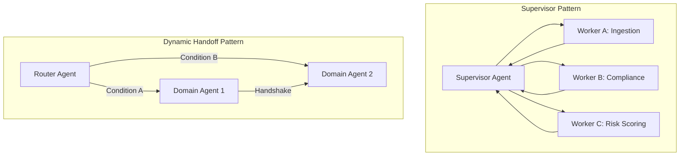

# Agentic AI & Workflow Orchestration — Production Engineering Report

Date: 2026-07-29
Status: Completed
NotebookLM Notebook: `AI Assistant for KYC System` (`e6743bf4-121a-4412-b6c4-0f87bda41730`)
Obsidian Vault Topic Hub: `Research/Medium/agentic-ai-workflow-orchestration.md`

---

## 1. Executive Summary

Production multi-agent systems are shifting from naive agent loops to **stateful, durable cognitive state machines**. Building production-grade multi-agent orchestrations requires solving three major engineering challenges: **unpredictable state drift, silent failures in non-deterministic loops, and context-window degradation**.

---

## 2. Production System Architecture: The Two-Layer Model

Modern enterprise production architectures decouple **Process Durability** from **Cognitive Reasoning**:

```
+-----------------------------------------------------------------------------------+
|                        LAYER 1: DURABLE PROCESS ORCHESTRATION                     |
|                   (Temporal.io / DB-Backed State Machine Engine)                  |
|  - Process State Persistence & Event Log Sourcing                                 |
|  - Automatic Exponential Backoff Retries & Timeout Enforcement                     |
|  - Interrupt & Resume Lifecycle for Human-in-the-Loop (HITL) Approval             |
+-----------------------------------------------------------------------------------+
                                         │
                                         ▼
+-----------------------------------------------------------------------------------+
|                           LAYER 2: COGNITIVE AGENT GRAPH                          |
|             (LangGraph / Microsoft Agent Framework / AutoGen v0.4)                |
|  - Stateful Directed Cyclic Graph (DCG) Execution                                 |
|  - Specialized Sub-Agent Reasoning & Tool Calling                                 |
|  - Dynamic Handoffs & State-Constrained Dispatching (SDOF)                        |
+-----------------------------------------------------------------------------------+
```

---

## 3. Foundational Multi-Agent Design Patterns



### A. Supervisor / Manager-Worker Pattern
* **Mechanism:** A central "Supervisor" agent acts as the control plane. It evaluates incoming requests, decomposes complex objectives into discrete sub-tasks, dispatches work to specialized domain agents, and synthesizes the outputs.
* **Best For:** Complex multi-domain tasks requiring high oversight and centralized policy enforcement.

### B. Sequential Pipeline Pattern
* **Mechanism:** A linear chain where Node $A \rightarrow \text{Node } B \rightarrow \text{Node } C$. State flows deterministically between steps.
* **Best For:** Highly structured, audit-sensitive compliance processes.

### C. Parallel (Fan-Out / Fan-In) Pattern
* **Mechanism:** Multiple specialized sub-agents execute concurrently to minimize wall-clock latency, followed by an aggregator node that synthesizes the results.
* **Best For:** Simultaneous document parsing, cross-referencing global sanctions databases, and multi-source background checks.

### D. Router & Dynamic Handoff Pattern
* **Mechanism:** Agents dynamically transition control to specialized peer agents based on runtime classification and state evaluation without needing to return to a central manager.
* **Best For:** Adaptive user-facing assistants where intent shifts dynamically during conversation.

### E. State-Constrained Dispatching (SDOF) *(Recent arXiv Research)*
* **Mechanism:** Restricts sub-agent dispatching using explicit state preconditions rather than free-form LLM routing. This mitigates the "alignment tax" (where complex agent routing causes model hallucination or infinite loops).

---

## 4. State Management & Execution Lineage

### A. Typed State Schemas
In production multi-agent systems, passing unstructured text strings between agents causes state corruption. Systems define strict **Pydantic / Type-safe state schemas**:

```python
class WorkflowState(BaseModel):
    session_id: str
    current_step: str
    payload: Dict[str, Any]
    history: List[AgentMessage] = []
    metadata: Dict[str, Any] = {}
```

### B. Execution Lineage & Reproducibility
Recent research (*"From Agent Loops to Deterministic Graphs: Execution Lineage for Reproducible AI-Native Work"*) emphasizes recording every state transition, LLM seed, tool call payload, and memory delta. Execution lineage enables:
1. **Time-travel debugging:** Replaying exact agent execution paths from any historical state checkpoint.
2. **Regression benchmarking:** Evaluating model upgrades against identical historical graph trajectories.

### C. Context Window Compaction & Memory Nodes
As sub-agents communicate, raw message histories saturate context windows. Production graphs implement **Summary & Pruning Nodes**:
- Periodic compaction of past agent dialogues into concise structured summaries.
- Isolation of raw tool call outputs to specific sub-agent local execution contexts, exposing only synthesized summaries to the parent graph.

---

## 5. Deliverable Quality vs. Maintained-State Quality *(arXiv 2026)*

Recent empirical evaluation of production multi-agent architectures reveals a critical distinction:

1. **The Illusion of Immediate Output Success:**
   * Unconstrained agent loops often produce a polished final text output that satisfies immediate evaluation metrics.
   * However, **loop-centric agents frequently introduce state drift**—leaving intermediate state variables, dependent sub-agent artifacts, and upstream metadata in an inconsistent or partially corrupt state.

2. **Longitudinal State Drift & Compounding Inconsistency:**
   * After a single iteration, state drift may appear benign.
   * Over long-horizon workflows or sequential revisions, this partial inconsistency **compounds rapidly**, corrupting downstream sub-agent context and leading to catastrophic workflow failure.

3. **The Solution — Execution Lineage & Deterministic DAG Replay:**
   * Systems utilizing explicit **Execution Lineage** and **Deterministic State Machine Graphs** guarantee that upstream changes propagate cleanly through intermediate nodes while preserving unaffected work, ensuring long-term state coherence across complex enterprise applications.

---

## 6. Human-in-the-Loop (HITL) & Safety Architecture

```
[Agent Graph Execution] ──► (Trigger: High-Risk Threshold) ──► [Pause Execution Graph]
                                                                        │
                                                                        ▼
[Resume Execution Graph] ◄── (Human Decision: Approve/Modify) ◄── [Wait for Human Gate]
```

### A. State Interruption Mechanics
* **`interrupt()` Pattern:** The cognitive graph pauses execution prior to writing state mutations to production databases, issuing financial transactions, or triggering external notifications.
* **State Checkpointing:** Graph state is persisted to durable storage while waiting for human intervention, freeing computing resources.

### B. HITL vs. HOTL
* **Human-in-the-Loop (HITL):** Execution **blocks** until an authorized human explicitly reviews and signs off on the agent's proposed plan (mandatory for high-risk actions).
* **Human-on-the-Loop (HOTL):** Execution proceeds autonomously, but real-time telemetry alerts human operators who hold override capabilities.

---

## 7. Multi-Agent Scaling Laws & Telemetry (Google Research Insights)

Recent research from Google Research (*"Towards a Science of Scaling Agent Systems"*) highlights critical scaling trade-offs:

1. **Agent Count vs. Communication Overhead:** Adding more sub-agents improves specialized performance up to a threshold, beyond which **$O(N^2)$ inter-agent communication overhead** degrades performance and increases token costs.
2. **Deterministic Graphs Outperform Open Loops:** Constraining agent interactions with deterministic graph edges achieves higher task completion rates than open-ended multi-agent chats.

### Recommended Telemetry Metrics (OpenInference / LangSmith / Phoenix)
* **Node Latency Distributions:** P50/P90/P99 execution time per sub-agent node.
* **Token Efficiency:** Ratio of tokens consumed to state progress.
* **Graph Loop Depth:** Tracking loop iterations to kill runaway recursive agent calls.

---

## 8. Primary Research Sources

1. **Google Research:** Towards a Science of Scaling Agent Systems: When and Why Agent Systems Work
2. **arXiv (2026):** From Agent Loops to Deterministic Graphs: Execution Lineage for Reproducible AI-Native Work
3. **arXiv (2026):** SDOF: Taming the Alignment Tax in Multi-Agent Orchestration with State-Constrained Dispatch
4. **LangChain Reference:** LangGraph Multi-Agent Supervisor Pattern
5. **Abhilash Ganji & TianPan.co:** Multi-Agent Orchestration & Designing State Machines Before Prompt Engineering
6. **Dev.to:** Agent State Management: How to Build Workflows That Recover Without You
