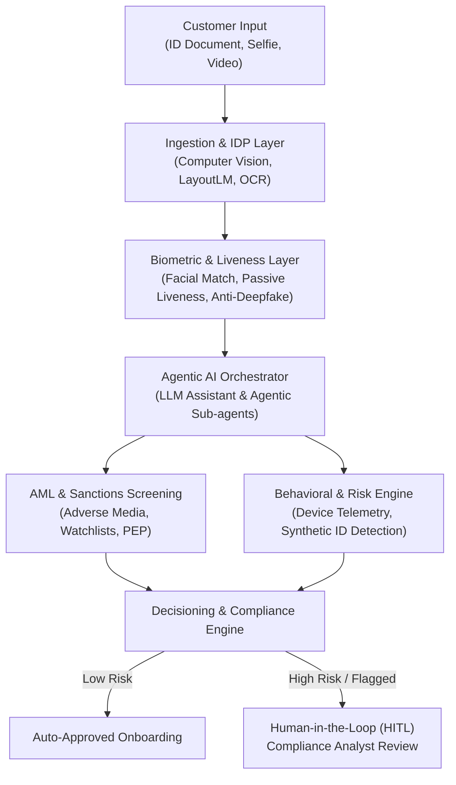

# AI Assistant for KYC System — Comprehensive Research & Architecture Report

Date: 2026-07-29
Status: Completed
NotebookLM Notebook: `AI Assistant for KYC System` (`e6743bf4-121a-4412-b6c4-0f87bda41730`)
Obsidian Vault Topic Hub: `Research/Medium/ai-assistant-kyc-system.md`

---

## 1. Executive Summary

AI Assistants for Know Your Customer (KYC) systems represent a paradigm shift from traditional, manual, and rigid rule-based onboarding workflows to **intelligent, adaptive, and agentic identity verification pipelines**. Modern financial institutions, fintechs, and digital banks combine multi-modal AI—including Intelligent Document Processing (IDP), Computer Vision, Voice & Facial Biometrics, and Agentic LLM Orchestrators—to automate customer onboarding, drastically lower false positives in Anti-Money Laundering (AML) screening, and enforce strict regulatory compliance.

---

## 2. End-to-End System Architecture

### Key Architectural Layers

#### A. Ingestion & Multi-Modal Intelligent Document Processing (IDP)
* **Adaptive OCR & Field Parsing:** Multi-modal AI models parse, extract, and normalize structured data from diverse global identity documents (passports, driver's licenses, national IDs, utility bills) regardless of lighting, orientation, or language.
* **Document Authenticity Verification:** Computer vision models analyze micro-print, font anomalies, digital image manipulation, and Machine Readable Zone (MRZ) checksums in real time to detect fraudulent documents.

#### B. Biometric Verification & Liveness Detection
* **Active & Passive Liveness:** Deep neural networks analyze depth mapping and skin texture (passive liveness) or challenge responses (active liveness) to prevent presentation attacks (printed photos, screen playbacks, deepfakes).
* **Voice Biometrics:** Acoustic models enable continuous identity verification during voice-assisted onboarding channels.
* **Certified Standards:** Regulators recommend ISO/IEC 30107-3 (iBeta Level 1 & Level 2) Presentation Attack Detection (PAD) compliance over superficial dashboard metrics.

#### C. Agentic AI & Workflow Orchestration
* **Interactive Onboarding Guidance:** Conversational AI assistants guide users step-by-step through onboarding, answer inquiries, and request document re-uploads when quality checks fail.
* **Autonomous Investigation Sub-Agents:** Autonomous AI sub-agents perform adverse media research, PEP (Politically Exposed Persons) checks, and complex UBO (Ultimate Beneficial Ownership) unraveling.

#### D. AML Screening & False Positive Reduction
* **Machine Learning Filtering:** AI models evaluate fuzzy matching and contextual intent in sanctions/watchlist screening, reducing false positive alerts by **70–90%**.
* **Risk Narrative Generation:** When an applicant is flagged, the AI generates a clear, structured risk summary explaining *why* the case requires escalation.

#### E. Security, Governance & Regulatory Compliance
* **Human-in-the-Loop (HITL):** High-risk decisions require analyst sign-off; escalations present compliance officers with auditable reasoning trails.
* **Configurable Autonomy & Kill Switches:** Granular autonomy settings per agent role with emergency system-wide kill switches.
* **Prompt Injection Isolation:** Strict security boundaries separate untrusted user input/document text from internal system command execution environments.
* **Explainable AI (XAI):** Ensures automated scoring decisions provide transparent audit trails compliant with FATF Digital Identity Guidelines, GDPR, and NIST SP 800-63 R4.

---

## 3. Deep Insights & Critical Threat Analysis

### 1. Generative AI Deepfakes & Facial Spoofing Threat
> *Europol documented organized fraud rings using generative AI video and synthetic faces to bypass both automated liveness detection algorithms and human reviewers during video KYC calls at European financial institutions. Modern systems require multi-spectral texture analysis and active micro-motion challenges to counter high-fidelity deepfakes.*

### 2. Demographic Bias & Fair Lending Exposure
> *Liveness systems trained on non-representative demographic datasets exhibit significantly higher False Rejection Rates (FRR) for specific skin tones, ages, and lighting conditions. In addition to customer friction, this exposes financial institutions to legal discrimination liability under fair lending and equal access statutes.*

### 3. Automated SAR / STR Narrative Generation
> *Agentic compliance workflows automate the extraction of transaction lineage, biometric logs, and screening flags to draft Suspicious Activity Reports (SARs) and Suspicious Transaction Reports (STRs). Compliance analysts review the generated narrative before submitting directly to regulatory bodies (e.g., FinCEN APIs).*

---

## 4. Primary Research Sources

1. **Alloy:** KYC Onboarding Software for Banks and Fintechs
2. **Infosys & NIST SP 800-63 R4:** Deciphering Digital Identity Guidelines for Financial Industry
3. **FluxForce AI:** Liveness Detection & Configurable Autonomy in KYC Compliance
4. **One Constellation:** Reducing False Positives in AML Screening with AI/ML
5. **Tecalis:** Voice Biometrics Verification Applications & Commercial Uses
6. **Didit.me & MindStudio:** Top KYC Providers & AI-Powered Client Onboarding Workflows
7. **IJERET:** Deep Learning Framework for Detecting Synthetic Identity Fraud
8. **FATF:** Guidance on Digital Identity Reports
