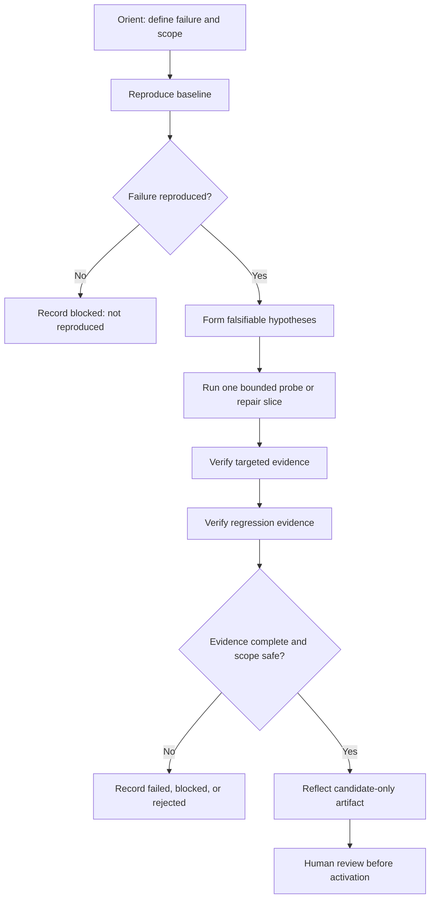

# Design Spec: Pure Learning Harness Skill

**วันที่:** 2026-08-22
**สถานะ:** ผู้ใช้อนุมัติ design ในแชต; spec นี้เป็น design record ก่อนสร้าง skill
**Portable source root:** `/Users/pisitkoolplukpol/Work/my-superpowers/`
**Related prototype:** `/Users/pisitkoolplukpol/Work/my-superpowers/experiments/learning-harness/`
**Related skill pattern:** `/Users/pisitkoolplukpol/Work/my-superpowers/skills/learning-pairing/SKILL.md`

## 1. วัตถุประสงค์

สร้าง `learning-harness` เป็น portable pure behavioral skill ที่ช่วยให้ agent
วิเคราะห์ CI/test failures แบบ evidence-backed โดยกำหนด workflow, checkpoints,
สถานะ, evidence discipline และ safety boundary อย่างชัดเจน

skill นี้เป็น guidance แบบเดียวกับ `learning-pairing` ไม่ใช่ runtime adapter,
ไม่ใช่ CLI wrapper และไม่ใช่ production code

## 2. ขอบเขตที่ล็อกแล้ว

### อยู่ในขอบเขต

- คำอธิบายว่าเมื่อใดควรใช้ skill
- natural-language และ direct-invocation guidance
- workflow ตั้งแต่รับ failure evidence จนถึง human review
- baseline, targeted และ regression verification ที่แยกกัน
- bounded reproduction และ falsifiable hypothesis guidance
- evidence/report/diff expectations
- failure statuses และการจัดการ blocked/rejected outcomes
- candidate-only reflection guidance
- safety, privacy และ no-activation boundaries
- installation และ verification guidance สำหรับ portable skill
- Mermaid flow diagram เพื่ออธิบาย lifecycle

### อยู่นอกขอบเขต

- การเรียก `python3 -m harness` หรือ command ใดโดยอัตโนมัติ
- การเพิ่ม runtime integration หรือ Kiro Crew core integration
- การแก้ `/Users/pisitkoolplukpol/Work/my-superpowers/experiments/learning-harness/`
- การแก้ `/Users/pisitkoolplukpol/Work/KiroCrew`
- การแก้ `/Users/pisitkoolplukpol/Work/kirocrew`
- การติดตั้งหรือ activate skill ใน `/Users/pisitkoolplukpol/.kiro/crew/skills/`
- การสร้าง real KiroCrew failure case ขึ้นเอง
- การ commit, push, merge หรือเปลี่ยน live branch
- การเขียน live memory, live skill หรือ production configuration

## 3. ความสัมพันธ์กับ skill อื่น

`learning-harness` และ `learning-pairing` เป็น complementary skills:

- `learning-pairing` กำหนดวิธีทำงานร่วมกับมนุษย์ เช่น Observe, Guided, Practice,
  roles และ checkpoint cadence
- `learning-harness` กำหนดวิธีคิดและตรวจสอบ CI/test failure เช่น reproduction,
  hypothesis, targeted/regression evidence และ candidate safety

skill ใหม่ต้องไม่อ้างว่ามี shared cursor, automatic metrics, persistent timeline,
runtime interception หรือ access ที่ runtime ไม่ได้ให้ไว้

ผู้ใช้สามารถใช้ `learning-pairing` ร่วมกับ `learning-harness` ได้ แต่ skill ใหม่
ต้องทำงานเป็น guidance เดี่ยวได้เช่นกัน

## 4. Skill identity และ invocation

ไฟล์ portable หลักคือ:

`/Users/pisitkoolplukpol/Work/my-superpowers/skills/learning-harness/SKILL.md`

frontmatter ที่เสนอ:

```yaml
---
name: learning-harness
description: Use when analyzing CI or test failures with bounded reproduction, evidence-backed hypotheses, separate baseline/targeted/regression validation, and candidate-only learning artifacts.
---
```

ควรรองรับทั้ง:

```text
$learning-harness
Failure: <bounded CI or test failure evidence>
Mode: Guided
```

และ natural-language fallback:

```text
Use the learning harness workflow to analyze this bounded test failure with evidence.
```

invocation นี้เป็นการเรียก behavioral guidance เท่านั้น ไม่ใช่คำสั่งให้ runtime
ค้นหา executable หรือเริ่ม process โดยอัตโนมัติ

## 5. Core workflow

skill จะใช้ workflow หกช่วง:

1. **Orient** — ระบุ failure signal, revision/environment, scope, owner และ
   Definition of Done
2. **Reproduce** — รันหรือวางแผน baseline reproduction แบบ bounded โดยไม่สรุปจาก
   log ที่ยังไม่ได้ตรวจ
3. **Hypothesize** — แยก observed facts จาก hypotheses และทำ hypothesis ให้
   falsifiable
4. **Probe/Repair** — เลือก minimal probe หรือ repair slice เดียว โดยเคารพ
   allowlist และ disposable boundary
5. **Verify** — แยก targeted evidence จาก regression evidence และตรวจ diff,
   changed files, timeout และ cleanup
6. **Reflect** — สรุปผล, limitation และ candidate-only learning artifact เพื่อ
   human review โดยไม่ activate อัตโนมัติ



ไม่ต้องถือว่าแต่ละช่วงหมายถึงการเรียก prototype เสมอไป หาก environment ไม่มี
harness ที่รองรับ ให้ skill ช่วยจัด reasoning และ acceptance evidence แทน และต้อง
ระบุสิ่งที่ยังไม่ได้รันอย่างตรงไปตรงมา

## 6. Evidence contract

ทุกผลลัพธ์ต้องแยกอย่างน้อย:

- **Observed fact:** command/log/test result ที่ตรวจหรือรันจริง
- **Hypothesis:** คำอธิบายที่ยังต้องพิสูจน์
- **Baseline evidence:** failure เดิมเกิดซ้ำหรือไม่
- **Targeted evidence:** repair แก้ failure เฉพาะจุดหรือไม่
- **Regression evidence:** repair ไม่ทำให้ behavior เดิมเสียหรือไม่
- **Scope evidence:** changed files อยู่ใน allowlist หรือไม่
- **Cleanup evidence:** disposable process/worktree/output ถูกจัดการครบหรือไม่
- **Limitations:** สิ่งที่การตรวจครั้งนี้ยังพิสูจน์ไม่ได้

ห้ามเรียกผลว่า `success` จาก targeted test เพียงอย่างเดียว และห้ามเรียก full
suite ผ่านจาก targeted run

## 7. Status vocabulary

skill ใช้ status vocabulary แบบ portable:

| Status | ความหมาย |
|---|---|
| `success` | baseline reproduced, targeted และ regression evidence ครบ และ scope ปลอดภัย |
| `failed` | มีการรัน verification แล้วแต่ repair หรือ regression ไม่ผ่าน |
| `blocked` | ไม่มี evidence เพียงพอ, baseline ไม่ reproduce, timeout, cleanup ไม่ชัดเจน หรือ runtime ไม่พร้อม |
| `rejected` | เปลี่ยนนอก allowlist, ฝ่าฝืน contract หรือ evidence ไม่ปลอดภัย |

status เป็นผลของ evidence ไม่ใช่ความมั่นใจจาก agent และต้องไม่ถูกลดระดับเพื่อให้
ดูเหมือนผ่าน

## 8. Candidate-only reflection

เมื่อ evidence เพียงพอ skill อาจเสนอ candidate lesson/skill/repair rule ได้ แต่ต้อง:

- ระบุ source evidence และ limitation
- ระบุ preconditions และ negative conditions
- ระบุ falsifier หรือวิธีทำให้ข้อสรุปผิดได้
- เก็บในสถานะ candidate-only
- รอ human review
- ไม่ activate, copy หรือเขียนทับ live memory/skill อัตโนมัติ

failure, blocked, rejected หรือ cleanup ที่พิสูจน์ไม่ได้ ห้ามสร้าง candidate ที่ดู
เหมือนเป็นข้อสรุปที่พร้อมใช้งาน

## 9. Safety and privacy boundary

skill ต้องสั่งให้ agent:

- ใช้ bounded commands และ explicit argv เมื่อมีการรันจริง
- ไม่ใช้ `shell=True` เป็นทางลัดใน implementation ที่เกี่ยวข้อง
- ไม่ใช้ dirty source checkout เป็น disposable execution root
- ไม่ส่ง credentials, tokens, `.env`, browser storage, session state หรือ private keys
  เข้า logs, prompts หรือ artifacts
- ไม่อ่าน credential files โดยไม่จำเป็น
- ไม่แก้ source ที่ผู้ใช้ห้ามแตะ
- ไม่สร้าง commit เพื่อ manufacture evidence
- ไม่ commit, push, merge, deploy หรือ activate candidate โดยไม่มี approval
- หยุดและรายงาน `blocked` เมื่อ cleanup หรือ isolation พิสูจน์ไม่ได้

## 10. Snapshot และ real-agent boundary

pure skill สามารถอธิบายแนวคิด clean pinned snapshot และ explicit real-agent gate ได้
แต่ไม่รับรองว่า runtime รองรับความสามารถนั้น

สำหรับ prototype ปัจจุบัน:

- synthetic fixture + deterministic fake เป็นเส้นทางที่พร้อมใช้
- snapshot runner เป็น implementation phase แยกต่างหาก
- arbitrary snapshot + fake ต้อง fail-closed เมื่อไม่มี deterministic patch plan
- real Kiro ต้อง explicit, bounded และ isolated
- ไม่มี real KiroCrew diagnosis หากยังไม่มี bounded failing case ที่ผู้ใช้ระบุ

รายละเอียด `--snapshot-repository`, exact `baseline_revision` และ
`DisposableWorktree` ยังคงอยู่ในเอกสาร implementation phase ไม่ถูกย้ายมาเป็น runtime
behavior ของ pure skill

## 11. Validation guidance ของ skill

เมื่อใช้ skill ต้องรายงาน validation แบบตรวจสอบได้:

```text
Validation
- Command/action: สิ่งที่รันหรือทำจริง
- Result: pass/fail/blocked/rejected พร้อมจำนวนเมื่อวัดได้
- Evidence: ผลนี้พิสูจน์อะไร
- Limitations: ผลนี้ยังไม่พิสูจน์อะไร
```

สำหรับ pure skill เอง การตรวจรับประกอบด้วย:

- frontmatter มี `name` และ `description` ที่ parse ได้
- workflow มี baseline, targeted, regression และ human review ครบ
- มี status และ candidate-only boundary ครบ
- ไม่มีคำสั่งติดตั้ง runtime integration เป็นพฤติกรรมบังคับ
- ไม่มี credentials, secrets หรือ host-specific runtime state
- มี Mermaid lifecycle diagram
- มี installation/verification guidance ที่ไม่ copy ทั้ง `$HOME/.kiro/crew`

## 12. Portable distribution

การแจกจ่ายให้ copy เฉพาะ directory ของ skill ไปยัง skills directory ของ runtime
ปลายทางตามกระบวนการที่ได้รับอนุมัติ

ห้ามแจกจ่าย:

- project source code ที่ไม่อยู่ในขอบเขต
- config, `.env` หรือ credentials
- session history, transcripts, runtime database หรือ logs
- live memory หรือ unrelated skills

การตรวจว่า skill โหลดได้ต้องตรวจ file presence, reload ตาม runtime และทดสอบ
invocation เล็ก ๆ ที่ยืนยันว่า agent แสดง workflow/evidence guidance โดยไม่อ้างว่า
มี runtime integration

## 13. Definition of Done

- มี portable `/Users/pisitkoolplukpol/Work/my-superpowers/skills/learning-harness/SKILL.md`
- skill เป็น pure behavioral guide แบบเดียวกับ `learning-pairing`
- body เป็นภาษาอังกฤษเพื่อ portability
- มี trigger, invocation, workflow และ Mermaid diagram
- มี baseline/targeted/regression evidence discipline
- มี `success`, `failed`, `blocked`, `rejected` guidance
- candidate เป็น candidate-only และ human review เท่านั้น
- ระบุ no-commit/no-push/no-activation/no-live-mutation boundary
- ไม่ผูกกับ CLI, Python module, Kiro Crew core หรือ runtime executable
- มี installation และ verification guidance ที่ไม่เผยแพร่ secrets
- self-review ไม่พบ placeholder, contradiction หรือ scope leakage

## 14. Implementation order หลัง spec review

1. สร้าง `SKILL.md` เพียงไฟล์เดียวใต้ portable source
2. ตรวจ frontmatter, trigger, scope และ forbidden behavior
3. ตรวจ Mermaid และ cross-reference กับ `learning-pairing`
4. แสดง unified diff ด้วย absolute path
5. ตรวจ skill แบบ static และ review เนื้อหา
6. ยังไม่ copy ไป runtime, ไม่ activate และไม่ commit

Snapshot runner implementation ยังคงเป็นงานแยกต่างหากหลัง pure skill ผ่านการ review
และไม่ควรถูกดึงเข้ามาใน skill-first phase นี้
