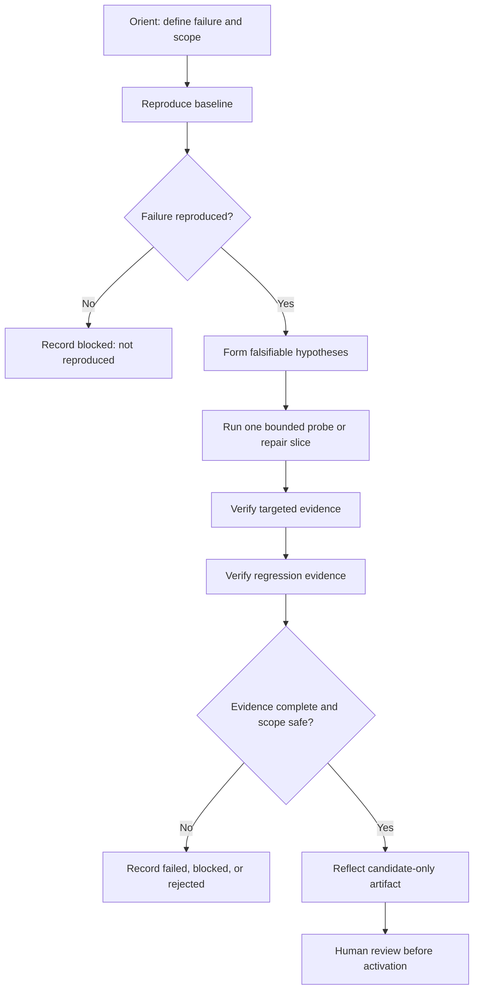

# Learning Harness

Use this skill to analyze CI and test failures as bounded, evidence-backed
experiments. The goal is not to make a red check look green. The goal is to
separate observed facts from hypotheses, reproduce the failure safely, evaluate
one repair slice against targeted and regression evidence, and preserve useful
learning without activating unreviewed changes.

This is a **behavioral guide**. It is not production code, a runtime adapter, a
CLI wrapper, or a promise that a particular harness, executable, permission, or
tool is available.

## When to use

Use this skill when the user:

- asks to analyze, reproduce, or repair a CI or test failure;
- wants evidence-backed debugging rather than a plausible guess;
- needs baseline, targeted, and regression checks kept separate;
- wants a safe learning recap, candidate lesson, or candidate repair rule;
- provides a bounded failing test, log, CI result, or reproducible case;
- invokes `$learning-harness` directly.

Do not force this workflow onto trivial work such as fixing a typo, answering a
short factual question, or formatting documentation unless the user explicitly
asks for failure-analysis discipline.

## How to invoke

Direct invocation:

```text
$learning-harness
Failure: <bounded CI or test failure evidence>
Mode: Guided
```

Natural-language fallback:

```text
Use the learning harness workflow to analyze this bounded test failure with evidence.
```

The invocation selects behavioral guidance only. It does not authorize a
process, grant credentials, install a dependency, change a repository, activate
a skill, or write memory.

## Core contract

At the beginning of a non-trivial investigation, state a concise contract:

```text
Learning Harness
- Goal: The user-visible outcome
- Definition of Done: The observable condition that means the investigation is complete
- Failure input: The exact bounded evidence currently available
- Phases: Orient -> Reproduce -> Hypothesize -> Probe/Repair -> Verify -> Reflect
- Checkpoint policy: Decisions that require approval and mechanical work that may continue
- Validation plan: The checks that will provide evidence
- Known limits: What the current environment or evidence cannot establish
```

Keep the human responsible for intent, ownership, production risk, and final
activation. Keep the agent responsible for organizing evidence, proposing
bounded probes, and reporting what actually happened. Do not expose private
chain-of-thought; provide concise reasoning summaries, assumptions,
alternatives, diffs, and user-checkable evidence.

## Workflow

Work through the following phases. Do not declare a phase complete without its
completion criterion.

### 1. Orient

- Restate the failure using the project's vocabulary.
- Capture the source of the signal: test output, CI check, log, report, or user observation.
- Identify the repository or artifact boundary, revision/environment identity, and relevant paths.
- State the Definition of Done in observable terms.
- Separate facts that were observed from claims that still need testing.
- Identify whether the requested action is analysis, repair, learning capture, or all three.

**Completion criterion:** The failure signal, scope, owner, Definition of Done,
and evidence limits are explicit.

### 2. Reproduce the baseline

- Prefer the narrowest command or experiment that can credibly reproduce the failure.
- Preserve the original command, environment identity, exit code, timeout, and useful output.
- Keep baseline evidence separate from any repair attempt.
- If the baseline passes unexpectedly, record `blocked` with `baseline_not_reproduced`.
- If the baseline is incomplete, flaky, unsafe, or unavailable, record the limitation instead of guessing.
- Do not weaken the reproduction only to obtain a failure or a pass.

**Completion criterion:** The failure is reproduced with bounded evidence, or the
reason it cannot be reproduced is recorded as a blocker.

### 3. Form falsifiable hypotheses

For each material hypothesis, record:

1. The observed fact that motivated it
2. The proposed cause
3. The consequence that should be observable if it is true
4. The observation that would falsify it
5. The smallest safe probe that distinguishes it from alternatives

Rank a small number of plausible hypotheses. Do not produce an unbounded list
or present a model-generated explanation as an observed fact.

**Completion criterion:** At least one bounded hypothesis has a concrete
falsifier and a minimal probe.

### 4. Probe or repair one slice

- Change one bounded variable at a time where practical.
- Prefer a red-capable test or probe before writing a broad implementation.
- Keep repair content out of untrusted case metadata unless the project's explicit contract allows it.
- Respect path allowlists, disposable workspaces, timeout limits, retry limits, and output bounds.
- If an adapter or tool returns malformed, unsafe, or unverifiable output, stop at `blocked`.
- Do not infer a patch from source or test output when the configured repair mechanism has no deterministic plan.
- Do not use a real agent or external service merely to fill a missing evidence gap without explicit approval and bounded setup.

**Completion criterion:** One probe or repair slice has a concrete result and a
traceable relationship to the hypothesis.

### 5. Verify targeted and regression evidence separately

Treat these as different claims:

- **Targeted evidence:** The original failure or intended behavior is addressed.
- **Regression evidence:** Existing behavior outside the narrow failure remains correct.
- **Scope evidence:** Only allowed files, paths, and artifacts changed.
- **Cleanup evidence:** Temporary processes, workspaces, and outputs are in a known state.

A targeted pass is not a regression pass. A green command is not sufficient if
it did not run the intended test or if cleanup is unverified.

When a project provides a harness, adapter, evaluator, or report format, use its
documented public contract. Do not assume that a named tool, command, status, or
runtime integration exists merely because this skill describes the concept.

**Completion criterion:** Targeted, regression, scope, and cleanup claims each
have an explicit result or an explicit limitation.

### 6. Reflect without activating

Summarize:

- what happened and why;
- which hypotheses were supported or falsified;
- which alternatives were rejected and why;
- what the evidence proves and does not prove;
- what changed, with a reviewable diff when changes were made;
- what reusable lesson could be proposed;
- what a human must review before activation.

A learning artifact is a candidate, not a live rule, unless a human explicitly
approves activation through the project's supported process.

**Completion criterion:** The user can inspect the result, evidence, limitations,
and proposed learning without relying on hidden agent reasoning.

## Reference flow



## Evidence contract

For every material result, distinguish the following fields in the report or
conversation:

```text
Observed fact: What command, test, log, or filesystem observation actually showed
Hypothesis: The proposed explanation that is still subject to falsification
Baseline evidence: Whether the original failure reproduced
Targeted evidence: Whether the intended failure or behavior was addressed
Regression evidence: Whether broader behavior remained correct
Scope evidence: Whether changed paths stayed within the allowed boundary
Cleanup evidence: Whether temporary state was removed or accounted for
Status: success | failed | blocked | rejected
Limitations: What this run still cannot establish
```

Do not claim a full-suite result from a targeted run. Do not claim coverage,
performance, cleanup, or source immutability unless it was actually measured or
inspected. Do not replace missing evidence with confidence language.

## Status vocabulary

Use these portable statuses when the surrounding project has no stricter
contract:

| Status | Meaning |
|---|---|
| `success` | The baseline was reproduced, targeted and regression evidence is complete, and scope and cleanup are safe. |
| `failed` | Verification ran, but the repair did not address the failure or caused a regression. |
| `blocked` | Evidence is insufficient, the baseline was not reproduced, a timeout or setup problem occurred, output was malformed, or cleanup/isolation is unverified. |
| `rejected` | The proposed change or evidence violates an allowlist, contract, privacy rule, or safety boundary. |

Status is an evidence result, not a confidence score. Never downgrade a blocker
to make a run appear successful.

Common failure classifications include:

- `baseline_not_reproduced`
- `timeout`
- `setup_or_environment_failure`
- `malformed_adapter_result`
- `targeted_failure`
- `regression_failure`
- `unsafe_scope`
- `cleanup_failure`
- `incomplete_evidence`

Use the project's existing names when they exist; do not create a second status
model merely for this skill.

## Candidate-only reflection

Only propose a candidate lesson, skill, or repair rule when the evidence supports
a bounded and reviewable claim. A candidate should include:

- the source evidence references;
- the observed condition and the proposed generalization;
- preconditions under which it may apply;
- negative conditions under which it must not apply;
- a falsifier or a test that could disprove it;
- known limitations and confidence boundaries;
- `candidate_only` status or the equivalent project status.

Do not create a candidate from a baseline that did not reproduce, a failed or
blocked verification, an unsafe diff, a malformed adapter result, or an
unverified cleanup. Do not activate, copy, or overwrite live memory or skills
automatically.

## Safety and privacy boundaries

The agent must:

- use bounded commands and explicit argv arrays when a command is run;
- preserve the project's timeout, retry, output, and path limits;
- use disposable workspaces for mutations when the project provides them;
- keep the supplied source or snapshot read-only when the workflow requires it;
- reject dirty or unpinned source inputs when clean provenance is required;
- keep reports, logs, diffs, and temporary artifacts outside protected source trees;
- treat cleanup failure as a blocker when final state is unknown;
- keep credentials, tokens, `.env` files, browser storage, session state, private keys, and unrelated personal data out of prompts and artifacts;
- avoid reading credential files unless an approved workflow explicitly requires it;
- stop on unsafe paths, malformed results, ambiguous ownership, or missing isolation;
- obtain explicit human approval before commit, push, merge, deploy, publication, or activation.

The agent must not:

- use a dirty source checkout as a disposable execution root;
- create a temporary commit merely to manufacture evidence;
- use `shell=True` as an unsafe shortcut in implementation work;
- fabricate a real failure, patch, test result, tool event, or runtime capability;
- bypass a failing required gate by weakening the test or changing the Definition of Done silently;
- mutate live memory, live skills, production configuration, or protected repositories;
- treat a candidate artifact as an active lesson.

## Snapshot and real-agent boundary

This skill may describe the concepts of clean pinned snapshots, isolated worktrees,
and explicit real-agent gates, but it does not guarantee that the current runtime
supports them.

Before using a real repository or real agent, require:

- an explicitly supplied source and revision;
- a clean-state and provenance check;
- a disposable mutation boundary;
- bounded commands, timeout, retry, and output limits;
- an explicit adapter selection;
- a human-approved failure case when the environment is sensitive.

If any prerequisite is missing, report `blocked` rather than relaxing the boundary.
Synthetic fixtures and deterministic fake agents are preferred for initial
validation. A real-agent path is opt-in, isolated, and never the default.

## Checkpoint format

Use one concise checkpoint before a material decision such as changing a public
contract, adding a dependency, modifying a security boundary, using a real agent,
accepting an untrusted snapshot, or activating a candidate:

```text
Checkpoint
- Context: Current phase and evidence collected
- Decision needed: The choice that changes the plan or safety boundary
- Options: A / B / C with short trade-offs
- Recommended option: The choice and why
- Risk if wrong: The consequence
- User action: What the user should approve, reject, or clarify
```

Do not interrupt for mechanical commands, routine reads, or checks that do not
change the plan. If ownership, business impact, domain accountability, or
production risk is involved, escalate it to a human.

## Validation reporting

Use this compact format after each meaningful validation step:

```text
Validation
- Command/action: The command or action that actually ran
- Result: Pass/fail/blocked/rejected, with counts when available
- Evidence: What the result proves
- Limitations: What it does not prove
- Artifacts: Reviewable paths or references, when available
```

If validation fails:

1. Show the exact failure signal and exit status when available.
2. Separate the observation from the hypothesis.
3. Choose one bounded corrective slice.
4. Rerun the original validation after the correction.
5. Add or identify a regression check before declaring the result green.
6. Preserve the blocker when the environment, cleanup, or evidence remains unsafe.

Never claim that a test, build, review, cleanup, or tool action passed if it was
not actually run.

## Working with `learning-pairing`

`learning-pairing` controls how the human and agent collaborate. This skill
controls how a CI/test failure is reasoned about and evidenced.

When both skills are active:

- use `learning-pairing` for roles, Observe/Guided/Practice behavior, and learning checkpoints;
- use `learning-harness` for baseline reproduction, hypotheses, targeted/regression separation, statuses, and candidate safety;
- do not ask two separate questions for the same decision;
- keep one shared Definition of Done and one validation record;
- preserve the stricter safety boundary when the two workflows differ.

Neither skill creates shared cursors, persistent timelines, automatic metrics, or
human-equivalent accountability.

## Distribution and verification

Distribute only the skill directory through the runtime's approved skill channel.
Do not copy an entire home directory or runtime state.

Do not distribute with the skill:

- credentials, access tokens, private keys, `.env` files, or secret configuration;
- browser cookies or session storage;
- session history, transcripts, runtime databases, lock files, or private logs;
- unrelated project source code;
- active memory or unrelated skills.

To verify a portable installation:

1. Confirm that the runtime's supported skills directory contains `learning-harness/SKILL.md`.
2. Reload or start a session using the runtime's documented skill-discovery process.
3. Invoke `$learning-harness` or the natural-language fallback with a small bounded example.
4. Confirm that the response states the workflow and evidence contract without claiming unavailable runtime capabilities.
5. Confirm that a non-reproduced baseline, unsafe scope, or missing cleanup is reported as `blocked` rather than silently bypassed.

If loading fails, check the directory name, filename, frontmatter, discovery
mechanism, and reload procedure before changing project code.

## Portable completion checklist

Before distributing this skill, verify that:

- [ ] The file has valid `name` and `description` frontmatter.
- [ ] Direct invocation and a natural-language fallback are documented.
- [ ] The skill is clearly behavioral guidance, not production code or a runtime adapter.
- [ ] Orient -> Reproduce -> Hypothesize -> Probe/Repair -> Verify -> Reflect is included.
- [ ] A Mermaid lifecycle diagram is included.
- [ ] Baseline, targeted, regression, scope, cleanup, and limitation evidence are distinguished.
- [ ] `success`, `failed`, `blocked`, and `rejected` outcomes are defined.
- [ ] Candidate artifacts are explicitly candidate-only and require human review.
- [ ] Snapshot and real-agent use is opt-in, bounded, isolated, and fail-closed.
- [ ] No credentials, runtime state, private transcripts, or project secrets are included.
- [ ] Installation and verification guidance does not copy an entire home directory.
- [ ] The skill does not silently commit, push, merge, deploy, activate, or mutate live state.

## Principle to remember

> Reproduce the failure, test one falsifiable idea, verify both the fix and the regression surface, and preserve learning only as a reviewable candidate.
