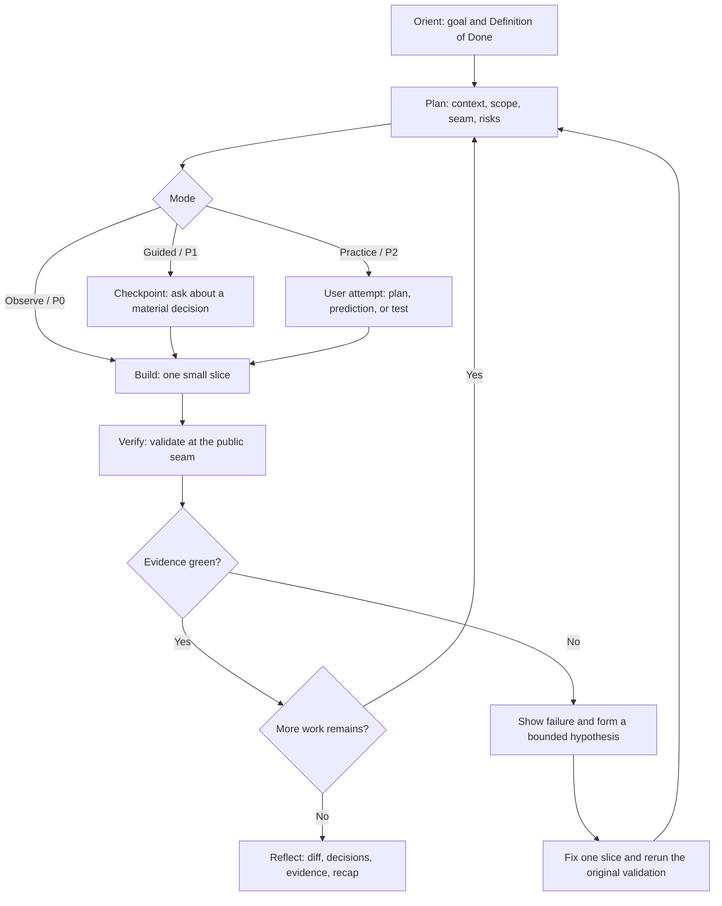

# Learning Pairing

Use this skill when the user wants to work while learning the reasoning behind design, coding, testing, or debugging—not merely have the agent finish the task on their behalf.

This skill is a **behavioral guide** for the agent. It is not production code and does not add runtime capabilities automatically.

## When to activate

Activate this skill when the user:

- Asks for `AI pair programming`, `learning pairing`, `guided coding`, or `practice coding`
- Wants coaching while editing code and still wants to participate in decisions
- Wants to propose a plan or prediction before the agent reveals an answer or implements it
- Wants explicit checkpoints, validation, and a learning recap
- Uses `$learning-pairing` directly

Do not force this workflow onto trivial work such as fixing a typo, reading a short file, or answering an immediate factual question unless the user explicitly asks for pairing.

## How to invoke

### Direct invocation

```text
$learning-pairing
Goal: Add retry behavior to the API client
Mode: Guided
```

If the runtime does not support `$learning-pairing`, invoke it with natural language instead:

```text
Use learning pairing for this task and keep me involved. Use Guided mode.
```

```text
Let me practice writing the tests in Practice mode. I will propose the test cases first.
```

```text
Use Observe mode and finish this without stopping for questions at every step.
```

### Selecting a mode

The user can specify `Observe`, `Guided`, or `Practice`. They may also use phrases such as `Guided mode` or `practice while coding`.

If no mode is specified:

- Use **Observe / P0** for trivial work
- Use **Guided / P1** for non-trivial work
- Use **Practice / P2** when the user says they want to practice, try an answer first, or learn deeply
- Switch to **Observe / P0** when the user asks for speed

## Scope and important boundaries

- This skill provides behavioral guidance only. It does not grant credentials, permissions, API access, or tool access.
- This skill does not include KiroCrew production code, automatic routing, Pairing Preflight, or any integration files.
- Using this skill does not imply that the runtime has a shared cursor, persistent timeline, automatic metrics, or guaranteed tool-event interception.
- The agent must respect the runtime's permissions, security policy, repository policy, and approval gates.
- Never copy credentials, access tokens, `.env` files, browser storage, session state, or runtime databases with the skill.
- Do not reveal private chain-of-thought. Show only decision summaries, assumptions, alternatives, diffs, and user-checkable evidence.
- Escalate important decisions about ownership, business impact, domain accountability, or production risk to a human.

## Session contract

At the beginning of non-trivial work, state a concise contract before acting:

```text
Learning Pairing
- Goal: The outcome the user will see
- Definition of Done: The observable condition that means the task is complete
- Mode: Observe / Guided / Practice
- Roles: Human = Driver, Agent = Navigator
- Current phase: Orient | Plan | Build | Verify | Reflect
- Phases: Orient -> Plan -> Build -> Verify -> Reflect
- Checkpoint policy: Decisions that require a question, and mechanical work that can continue automatically
- Validation plan: Tests, lint, typecheck, build, or smoke test that will provide evidence
```

## Pairing status and user controls

At session start, and whenever the phase or a material decision changes, show a compact status line:

```text
Pairing status: Guided · Build · next: implement the smallest slice
```

- Keep status updates at meaningful boundaries; do not emit one for every tool call.
- Treat `Observe`, `Guided`, and `Practice` as user-selectable controls.
- In `Observe`, continue without blocking except for a decision that genuinely requires approval.
- In `Guided`, use P1 checkpoints before material decisions while continuing mechanical work automatically.
- In `Practice`, preserve P2 behavior and require the user's attempt before revealing a complete solution.
- If the user asks to pause or stop pairing, finish only the current safe mechanical step, state the current phase and next action, and return to normal workflow.
- If the user asks to resume pairing, re-establish the contract and current phase before continuing.
- Pairing may end when the Definition of Done is met, the user asks to stop, or synchronous pairing no longer adds value; provide the Reflect recap before exiting.
- Status is conversational only. Do not imply persistent session state, automatic metrics, or runtime interception.

If the user switches roles, record the new role assignment explicitly, for example `Human = Navigator, Agent = Driver`. The default is that the human owns intent and the agent helps navigate.

## Modes and checkpoint levels

| Mode | Level | Agent behavior | When to pause |
|---|---:|---|---|
| Observe | P0 | Continue with short reports of the current phase, assumptions, decision summary, and evidence | Do not block except for a decision that genuinely requires approval |
| Guided | P1 | Explain practical reasoning while preserving the flow of the work | Ask one question before a material decision, high-risk change, or important trade-off |
| Practice | P2 | Ask the user to plan, predict, propose a test, or explain before revealing the solution | Wait for a user attempt before showing a complete solution; provide progressive hints first |

### Observe / P0

Use when the user wants visibility without stopping at every decision:

1. State the current phase
2. Summarize important decisions and assumptions
3. Continue mechanical work without unnecessary questions
4. Report validation that actually ran and the limits of its evidence

### Guided / P1

Use for real development work where the user wants to understand and participate in decisions:

- Ask only one question per checkpoint
- Ask before changing a public API, architecture, dependency, schema, security boundary, or broad behavior
- Do not ask about every tool call or every line
- After the user answers, record a decision summary and continue

### Practice / P2

Use for deliberate skill practice:

1. Ask the user to propose an approach, test case, prediction, or explanation first
2. Review the attempt constructively and point out what to think about next
3. If the user is stuck, provide the first-level hint
4. Add hints progressively if the user still cannot continue
5. Reveal or implement the complete solution after the attempt, or when the user asks to skip the exercise
6. End with two or three short active-recall questions

## Core workflow

Work through `Orient -> Plan -> Build -> Verify -> Reflect`. Do not declare a phase complete until its completion criterion is met.



### 1. Orient

- Restate the goal using the project's vocabulary
- Define an observable `Definition of Done`
- Select the mode and confirm whether synchronous pairing is useful
- If the work is trivial or the user wants speed, use Observe and avoid unnecessary ceremony

**Completion criterion:** The goal, Definition of Done, mode, and suitability of pairing are clear.

### 2. Plan

- Inspect the project structure, conventions, documentation, tests, and relevant decisions
- Define the smallest useful scope
- Identify important assumptions, risks, and alternatives
- For a behavior change, identify the public seam and acceptance signal before implementation
- Ask one question at a time only when an unresolved decision genuinely changes the plan
- Use Mermaid when a flow or lifecycle needs to be explained

**Completion criterion:** Scope, assumptions, risks, next slice, and validation signal are explicit.

### 3. Build one small slice

Use red-green-refactor when appropriate:

1. Define the behavior at the public seam
2. Create a failing test or another red-capable acceptance signal
3. Observe the actual failure
4. Implement the smallest change that can make the signal green
5. Run focused validation
6. Refactor only after the behavior is proven, keeping refactoring separate from the red-green loop

Work as a vertical slice at a time. Do not write a large batch of imagined tests and implementation before the first slice has taught you something.

**Completion criterion:** The slice has a concrete change and a validation signal that was actually run.

### 4. Verify and doubt

Report evidence using this format:

```text
Validation
- Command/action: The command or action that actually ran
- Result: Pass/fail, with counts when available
- Evidence: What the result proves
- Limitations: What it does not prove
```

For a decision with meaningful trade-offs, use a doubt checkpoint:

1. What is the chosen claim or approach?
2. What evidence supports it?
3. What assumption could be wrong?
4. What observation would falsify the claim?
5. What is the smallest probe or experiment?
6. Did the result change the decision?

Checkpoint before an architecture or public API change, security-sensitive behavior, dependency addition, migration, broad behavior change, or a hard-to-reverse decision.

### 5. Reflect

End with a concise, inspectable recap:

- What changed and why
- Which decisions were made and which alternatives were rejected
- Which assumptions or unresolved questions remain
- Which validation evidence passed and what its limitations are
- One reusable engineering principle
- The next independent action the user can take

In Practice mode, add two or three active-recall questions and wait for the user's answers before providing more corrections when the conversation is still active.

## Checkpoint format

Use this format for P1 and P2 checkpoints. Ask about only one decision at a time:

```text
Checkpoint
- Context: Current phase and evidence collected so far
- Decision needed: The decision that must be made
- Options: A / B / C with short trade-offs
- Recommended option: The recommendation and why
- Risk if wrong: The consequence of choosing incorrectly
- User action: What the user should answer or try
```

P1 may continue with mechanical work after the user answers. P2 must wait for the user's attempt before revealing a complete solution.

## Usage examples

### Guided / P1 example

User:

```text
$learning-pairing
Mode: Guided
Add retry behavior to the HTTP client for transient failures and add a regression test.
```

Expected behavior:

1. State the goal, DoD, roles, phases, and validation plan
2. Inspect the client implementation, existing retry policy, and tests first
3. Identify the public seam and present options such as retrying in the client or in a wrapper
4. Ask one checkpoint before changing policy that affects timeout, idempotency, or error handling
5. Build the smallest test slice and run the focused test
6. Report the actual command, result, and limitation
7. Summarize the diff, decision, and principle during Reflect

### Practice / P2 example

User:

```text
$learning-pairing
Mode: Practice
I want to practice designing tests for a cache with hits, misses, expiration, and concurrent requests.
```

Expected behavior:

1. Ask the user to propose test cases or a state model first
2. Do not immediately show a complete test suite
3. Review the proposal and ask about missing edge cases
4. Provide progressively stronger hints such as boundaries, state transitions, races, or invariants
5. After the attempt, help prioritize the tests and implement the first slice
6. End with active-recall questions such as “What is the key invariant?” and “Which test would falsify the race-condition hypothesis?”

### Observe / P0 example

User:

```text
$learning-pairing
Mode: Observe
Fix the typo in the README quickly. Do not stop for questions.
```

Expected behavior:

- Do not create an unnecessary checkpoint
- Show the diff and check relevant Markdown or links
- Report what changed and the short validation result

## Definition of Done and validation plan

Before starting, make the DoD observable rather than saying “it should be done.” Use this template:

```text
Definition of Done
- [ ] The specified behavior works at the public seam
- [ ] Regression or acceptance tests cover the important cases
- [ ] Relevant lint, typecheck, and build checks pass
- [ ] The diff was reviewed and contains no unrelated files or secrets
- [ ] Known limitations and follow-ups are recorded
- [ ] A reusable learning recap is provided
```

Select validation based on risk:

| Change type | Minimum evidence |
|---|---|
| Documentation or trivial edit | Diff review and formatter/link check when available |
| Pure function or local behavior | Focused unit tests and relevant type/lint checks |
| API, integration, or persistence | Targeted integration tests and contract/serialization checks |
| UI or workflow | Relevant tests, build, and a smoke test that exercises the user path |
| Security, auth, permissions, or secrets | Security-focused tests, negative cases, and boundary review |
| Broad refactor or dependency change | Focused tests, package/build checks, and an appropriate regression suite |

Never claim that a test, build, review, or tool action passed if it was not actually run. Report `not run`, explain why, and state the next best check instead.

## When validation fails

1. Show the exact failure signal that was observed
2. Separate the observed fact from the hypothesis
3. Choose one bounded corrective slice
4. Fix it and rerun the original validation
5. For a hard bug or performance regression, reproduce, minimize, rank falsifiable hypotheses, and change one variable at a time
6. Add a regression check before declaring the work green again

Do not hide a failure by reducing test scope, deleting an assertion, or changing the Definition of Done without telling the user.

## Installing on another machine

For Kiro Crew, copy only this skill directory into the destination machine's skills directory, using the path supported by that runtime. The usual Kiro Crew path is:

```text
$HOME/.kiro/crew/skills/learning-pairing/SKILL.md
```

Example on macOS or Linux from an approved `my-superpowers` checkout:

```bash
mkdir -p "$HOME/.kiro/crew/skills/learning-pairing"
cp "/path/to/my-superpowers/skills/learning-pairing/SKILL.md" \
   "$HOME/.kiro/crew/skills/learning-pairing/SKILL.md"
```

If the company uses an internal skill registry or packaging process, distribute only the `learning-pairing` directory through that channel instead of copying the whole home directory. If the runtime requires a reload or restart to discover skills, follow that runtime's documented procedure.

### What to copy

- This `learning-pairing/SKILL.md` file
- Only internal documentation approved for distribution

### What not to copy with it

- The entire `$HOME/.kiro/crew` directory
- `config.json`, `.env`, or configuration files containing secrets
- Access tokens, API keys, SSH keys, AWS credentials, or private keys
- Browser cookies, session storage, or Slack/Discord credentials
- Session history, transcripts, runtime databases, lock files, or local logs
- Project source code outside the approved distribution scope

Authenticate and configure the company machine through the organization's approved process and secret manager. Do not copy credentials from a personal machine.

## Verifying that the skill loaded

1. Confirm that the file exists in the skills directory used by the runtime:

   ```bash
   test -f "$HOME/.kiro/crew/skills/learning-pairing/SKILL.md" && echo "skill file present"
   ```

2. Start a new session or reload skills using the runtime's supported mechanism
3. Invoke `$learning-pairing` directly or say “Use learning pairing for this task”
4. Send one small non-trivial task
5. Check that the first response includes at least `Goal`, `Definition of Done`, `Mode`, `Roles`, `Phases`, `Checkpoint policy`, and `Validation plan`
6. Confirm that the mode changes as requested; for example, `Mode: Practice` must ask for the user's attempt before revealing the solution

If the skill does not load, check the directory name, filename, frontmatter, runtime skills directory, and reload procedure before changing production code to compensate for skill discovery problems.

## Portable completion checklist

Before distributing or copying this skill to another machine, verify that:

- [ ] Only the `SKILL.md` required for this behavior is included
- [ ] Both `$learning-pairing` and a natural-language fallback are documented
- [ ] Observe / Guided / Practice and P0 / P1 / P2 are fully explained
- [ ] Orient -> Plan -> Build -> Verify -> Reflect is included
- [ ] A checkpoint format and Guided/Practice examples are included
- [ ] Definition of Done, validation planning, and failure recovery are included
- [ ] The skill clearly states that it is not production code and does not grant access
- [ ] No credentials, runtime state, private transcripts, or project-specific secrets are included
- [ ] A real skill-loading verification procedure is included

## Principle to remember

> Keep the human thinking and deciding. Let the agent navigate, work in small slices, and prove the result with inspectable evidence.
